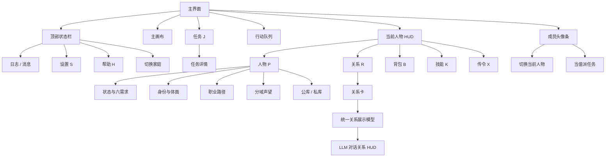

# 主界面与人物面板信息架构 PRD

> 日期：2026-06-23
> 状态：P0 已落地，本文按当前 UI 现状重写
> 关联文档：`持续更新_02关系.md`、`持续更新_06基础需求与状态.md`、`持续更新_08身份礼法与场景权限.md`、`持续更新_09人生路径与故事节点.md`、`持续更新_19_AI与梦想系统联动.md`

## 1. 目标

主界面只保留玩家当前决策需要的信息，完整解释下沉到人物、关系、技能、任务、日志等面板。

一句话口径：

```text
主界面 = 现在看什么、点什么
人物 P = 这个人是谁、处境如何
关系 R = 当前人物和别人怎么处
任务 J = 当前人物有什么事
行动 = 当前人物接下来做什么
日志 = 发生过什么
后台 S = 怎么配置和调试
```

## 2. 总原则

- 底部 UI 只放当前人物的即时状态。
- 任务只展示当前人物的任务，不混入其他人物。
- 行动只展示当前人物的行动队列。
- 关系面板只展示两两关系，不展示职业、声望、身份详情。
- 人物面板展示个人身份、需求、状态、职业、声望、资源。
- 家庭不再单独占底部高度，只保留头像条叠在画布上。
- 配置后台和玩家前台的命名、轴顺序、关系标签必须一致。

## 3. 主界面布局

### 3.1 区域职责

| 区域 | 位置 | 内容 | 行为 |
|---|---|---|---|
| 顶部状态栏 | 顶部 | 地点、日期、时辰、天气、LLM 开关、日志、设置、帮助、切换家庭 | 常驻 |
| 主画布 | 中央 | 地图、人物、家具、气泡、家庭头像背景 | 常驻 |
| 任务 J | 左上浮层 | 当前人物任务摘要 | 默认收起，向上收起，展开向下 |
| 行动队列 | 左下，人物 HUD 上方 | 当前人物行动队列 | 默认展开，有行动时向上堆叠 |
| 当前人物 HUD | 左下 | 当前人物、六需求、状态、身份职业摘要、资源摘要、快捷入口 | 常驻 |
| 成员头像条 | 左下 HUD 下方 / 背景叠层 | 家庭成员头像、当前选中、当值标记 | 不单独占背景高度 |
| 面板浮层 | 居中 | 人物、关系、背包、技能、任务、日志等详情 | 点击入口打开 |

### 3.2 主界面示意图

```text
┌────────────────────────────────────────────────────────────────────────────┐
│ 顶部状态栏：地点 / 日期 / 时辰 / 天气 / LLM / 日志 / 设置 / 帮助 / 切换家庭 │
├────────────────────────────────────────────────────────────────────────────┤
│ 【任务 J】默认收起                                                         │
│                                                                            │
│                                                                            │
│                         主画布：地图 / 人物 / 家具 / 气泡                   │
│                                                                            │
│                                                                            │
│ 【行动队列】当前行动在下，后续行动向上出现                                  │
│ 【当前人物 HUD】人物 P / 关系 R / 背包 B / 技能 K / 传令 X                  │
│ [头像] 名字 当前状态 / 六需求水位 / 身份职业 / 公库私库                    │
│ [成员头像][成员头像][当前人物*][当值△]  家庭头像叠在画布上                  │
└────────────────────────────────────────────────────────────────────────────┘
```

## 4. 当前人物 HUD

### 4.1 定位

当前人物 HUD 只回答：

```text
当前选中人物是谁？正在做什么？是否有即时风险？
```

### 4.2 展示内容

| 模块 | 内容 | 说明 |
|---|---|---|
| 头像 / 立绘 | 当前人物视觉识别 | 点击可打开人物面板 |
| 名字 | 当前人物简称 / 名字 | 不展示性格 |
| 当前状态 | `statusText` | 如“正在协理家务” |
| 身份职业摘要 | 身份位阶、职业阶段、主导评价 | 只做摘要 |
| 资源摘要 | 公库、私库 | 只显示关键数值 |
| 六需求 | 心绪、精力、饥饿、清洁、社交、意趣 | 每项一个水位圆点 |
| 状态标签 | 疲惫、病中、掌事中等 | 只展示高优先级状态 |
| 快捷入口 | 人物 P、关系 R、背包 B、技能 K、传令 X | 紧贴 HUD |

### 4.3 六需求水位

六需求不使用多点刻度，只使用一个固定圆点：

```text
心绪●  精力●  饥饿●  清洁●  社交●  意趣●
```

规则：

- 圆点尺寸固定，避免布局抖动。
- 圆点内部水位高度表示满足程度 `0-100`。
- hover 显示具体数值、说明、风险、适配提示。
- 颜色只表达风险：正常、偏低、危急。
- 前台展示名称必须与后台配置一致。

### 4.4 不展示内容

当前人物 HUD 不展示：

- 性格。
- 完整职业路径。
- 完整技能列表。
- 完整声望列表。
- 完整关系摘要。
- 其他人物任务。

这些信息进入人物面板、技能面板、关系面板或任务面板。

## 5. 行动队列

### 5.1 定位

行动队列展示当前人物接下来要做什么，放在当前人物 HUD 上方，模拟“从下往上堆行动”的感觉。

### 5.2 当前规则

| 项 | 规则 |
|---|---|
| 位置 | 左下，当前人物 HUD 上方，间距约 8px |
| 展开 | 默认展开 |
| 空态 | 无行动时收成最短空态 |
| 有行动 | 至少容纳 5 个行动 |
| 超过 5 个 | 队列内部滚动 |
| 标题 | “行动”标题放在底部 |
| 分页 | 不使用左右分页箭头 |
| 顺序 | 当前行动在最下面，后续行动向上出现 |
| 范围 | 只展示当前人物行动 |

### 5.3 示意图

```text
┌──────────────────┐
│ 5 练习针线        │
│ 4 使用茶桌        │
│ 3 与平儿交谈      │
│ 2 去荣禧堂        │
│ 1 协理家务        │
├────── 行动 ──────┤
└──────────────────┘
```

空态：

```text
┌──────────────────┐
│ 暂无排队行动      │
├────── 行动 ──────┤
└──────────────────┘
```

## 6. 任务 J

### 6.1 定位

任务栏是当前人物任务摘要，不是全局任务面板。

### 6.2 规则

| 项 | 规则 |
|---|---|
| 位置 | 主画布左上浮层 |
| 默认状态 | 收起 |
| 收起方向 | 向上收起 |
| 展开方向 | 向下展开 |
| 展示范围 | 只展示当前人物任务 |
| 展示内容 | 待回应、进行中、阻塞、紧急任务 |
| 完整任务 | 进入任务详情面板 |

### 6.3 示意图

收起态：

```text
┌────────────┐
│ 任务 J  3  │
└────────────┘
```

展开态：

```text
┌──────────── 任务 J ────────────┐
│ ⚠ 王夫人查问       待回应       │
│ 协理家务           进行中 60%   │
│ 发月钱             进行中 20%   │
│                         [收起] │
└────────────────────────────────┘
```

## 7. 家庭成员头像

### 7.1 定位

家庭成员不再占独立底栏，只作为头像条聚集在左下角，与当前人物 HUD 和行动队列组成一个操作区。

### 7.2 展示规则

| 内容 | 规则 |
|---|---|
| 成员头像 | 横向排列 |
| 当前人物 | 高亮 |
| 当值人物 | 头像上显示小标记 |
| 切换人物 | 点击头像 |
| 派任务 | 点击当值标记或传令入口 |
| 家庭背景 | 不单独占高度，画布显示在背后 |

示意：

```text
[贾母] [王夫人] [凤姐*] [贾琏] [平儿△] [袭人]
* 当前选中    △ 当值，可点
```

## 8. 摄像机与遮挡

左下 UI 叠在画布上，因此镜头跟随必须考虑安全区。

规则：

- 人物走到地图左下角时，镜头允许越过原地图边界。
- 左侧安全区避开行动队列。
- 底部安全区避开行动队列和当前人物 HUD。
- 人物不能被左下 HUD、行动队列、成员头像挡住。
- 家庭住所镜头跳转也使用同一套边界逻辑。

## 9. 人物面板 P

### 9.1 定位

人物面板是当前人物档案，回答：

```text
这个人是谁？处境如何？正在走什么路？
```

### 9.2 内容结构

| 区块 | 内容 |
|---|---|
| 顶部摘要 | 姓名、当前状态、身份职业、主导评价、公库私库 |
| 状态与需求 | 六需求具体值、说明、风险、状态标签、健康 |
| 身份与体面 | 身份位阶、家庭身份、身份参考声望、礼法位置 |
| 职业路径 | 当前路径、当前阶段、下一阶段、晋升条件 |
| 财产资源 | 公库、私库、后续物品 / 背包 |
| 分域声望 | 府内体面、下人间口碑、外部名声、功名体面、才名等 |
| 操作 | 关系网络、路径详情、背包、技能详情、关闭 |

### 9.3 人物面板示意图

```text
┌──────────────────── 王熙凤 · 人物档案 ────────────────────┐
│ 平辈主子 · 协理管事 · 威风凛凛                              │
│ 正在协理家务 · 公库1200两 · 私库35两                         │
├────────────────────────────────────────────────────────────┤
│ 状态与需求：心绪●72 精力●41 饥饿●63 清洁●58 社交●81 意趣●25 │
│ 状态：[疲惫] [掌事中] [明察秋毫]                             │
├────────────────────────────────────────────────────────────┤
│ 身份与体面：平辈主子 / 荣禧堂 / 府内体面 80                  │
├────────────────────────────────────────────────────────────┤
│ 职业路径：凤姐·管家之路 · 协理管事 / 下一阶：掌权弄权         │
├────────────────────────────────────────────────────────────┤
│ 分域声望：府内体面、下人间口碑、外部名声、功名体面、才名      │
├────────────────────────────────────────────────────────────┤
│ [关系网络] [路径详情] [背包] [技能详情] [关闭]                │
└────────────────────────────────────────────────────────────┘
```

## 10. 关系面板 R

### 10.1 定位

关系面板只回答：

```text
当前人物和其他人关系如何？
```

不展示职业路径、分域声望、个人身份详情。

### 10.2 关系卡内容

| 内容 | 规则 |
|---|---|
| 对象名字 | 卡片顶部左侧 |
| 综合关系分 | 卡片顶部右侧，显示 `+N/-N` |
| 关系四象限图 | 卡片主体 |
| 友谊 | 固定展示 |
| 姻缘 | 固定展示 |
| 信任 | 固定展示 |
| 第四象限 | 主仆显示服从 / 体恤；亲缘显示孝道 / 慈爱；其他可为空 |
| 名字下摘要 | 不展示，避免与图内标签重复 |

### 10.3 综合分与中心标签

关系卡中有两处综合分：

- 右上角 `+N/-N`：综合关系分数值。
- 圆心 `+N/-N`：同一个综合关系分，用水位表现。

圆心水位规则：

- 正值使用上半圆水位。
- 负值使用下半圆水位。
- 当前只是 P0 表达，未来可以做成“高山 / 深水”的视觉。

圆心标签规则：

- 从“姻缘、友谊、综合分”三者中取数值最高者。
- 姻缘、友谊取对应轴的【关系标签】。
- 综合分取综合分的【关系标签】。
- 不取 `relationName`。
- 不优先使用综合关系名。

示例：

```text
┌──────────────┐
│ 黛玉      +60 │
│              │
│   友谊        │
│       ╭────╮ │
│ 姻缘  │好友 │ 信任
│       │+60 │ │
│       ╰────╯ │
│   体恤        │
└──────────────┘
```

### 10.4 关系轴顺序

底层展示模型统一为：

```text
友谊 → 姻缘 → 信任 → 第四象限
```

关系面板可以按四象限方位绘制，但数据模型和 LLM 对话面板必须使用同一套轴、标签、阶段和数值。

## 11. LLM 对话关系 HUD

### 11.1 定位

LLM 对话浮层里的关系展示不是单独系统，而是关系面板的另一种展示形式。

同一套底层：

```text
relationAxisDisplayModel(ri, c, t)
```

关系面板把它画成四象限图；LLM 对话把它画成纵向关系条。

### 11.2 顶部综合关系

旧逻辑删除：

- 不再显示“情分”。
- 不再显示“朋友/友好 · 陌生人”。

新逻辑：

```text
关系图中心标签 + 综合分
```

示例：

```text
萍水相逢 +18
好友/亲密 +60
```

该标签必须与关系面板圆心标签一致。

### 11.3 关系条顺序

LLM 对话面板关系条固定顺序：

```text
友谊
姻缘
信任
体恤 / 服从 / 孝道 / 慈爱
```

每条展示：

- 轴名。
- 当前数值。
- 进度条。
- 当前对话中的变化量。

### 11.4 涨跌效果

对话开始时记录 baseline。

刷新事件：

- `relation:axis_change`
- `relation:change`
- `interaction:effects`

展示规则：

- 上涨轴绿色高亮，显示 `+N`。
- 下跌轴红色高亮，显示 `-N`。
- 未变化轴正常展示。
- hover/title 显示轴名、阶段标签、当前值、变化量。

## 12. 技能 K

技能不再常驻底部，只作为快捷入口打开。

```text
[技能 K]
```

技能面板展示：

- 技能名。
- 等级。
- 经验。
- 状态封锁。
- 来源解释。

## 13. 背包 B

背包入口已保留，背包系统未完整实现。

当前口径：

- 底部只放入口。
- 人物面板展示公库 / 私库。
- 物品、信物、背包完成后接入人物面板和梦想条件。

## 14. 日志 / 消息

日志入口在顶部状态栏，默认不占主界面空间。

建议筛选：

```text
活动 / 社交 / 任务 / 系统 / 声望 / 关系
```

日志内容用于解释系统变化，不在底部 HUD 重复展示。

## 15. 入口关系图



## 16. 已落地验收标准

| 模块 | 验收口径 |
|---|---|
| 任务 | 默认收起，只显示当前人物任务 |
| 行动 | 位于人物 HUD 上方，有行动时至少 5 条，空态短条，无左右箭头 |
| HUD | 左下紧凑，不显示性格，六需求 hover 有数值说明 |
| 成员头像 | 聚集左下，不单独占家庭背景高度 |
| 镜头 | 左下边界人物不被行动队列和 HUD 挡住 |
| 关系面板 | 名字下无重复摘要，综合分右上和圆心一致 |
| 关系中心 | 标签取姻缘 / 友谊 / 综合分最高者的关系标签，水位表达正负 |
| LLM 关系 HUD | 顶部标签和关系图中心一致，关系条顺序为友谊 / 姻缘 / 信任 / 第四象限 |
| 涨跌 | LLM 对话中变化轴高亮并显示 `+N/-N` |

## 17. 后续 P1

| 项 | 目的 |
|---|---|
| 关系卡点击人物跳人物档案 | 跨面板联动 |
| 关系中心高山 / 深水视觉 | 强化综合分正负意象 |
| 人物面板加入梦想摘要 | 接 AI / 梦想系统 |
| 人物面板加入健康摘要 | 接健康 / 生病系统 |
| 任务缺口跳转 | 点击缺声望 / 关系 / 身份条件跳对应面板 |
| 背包系统接入人物档案 | 钱、物、信物统一 |
| 日志按人物筛选 | 追踪个人变化 |
