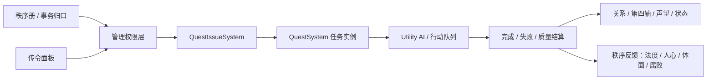

# 传令与上下级管理面板 PRD

> 更新时间：2026-07-14
> 文档定位：定义“传令”作为统一的任务分配、下属管理和未来职业上下级管理入口。  
> 最新口径：所有可点击的任务下发入口统一叫“传令”；“点名传令”和“群体传令”是同一个面板里的两种模式；“当值/轮值”作为便捷的对单个人的传令入口，也需同步传令的改动。

## 1. 设计目标

“传令”不再只是一个群体任务按钮，而是当前人物对可管理对象进行事务分配的统一入口。

目标：

- 底栏传令、人物互动里的差遣、当值仆从快捷入口，命名统一为“传令”，或“令”。
- 支持主子对仆从、管事对下属、职业上级对职业下级、皇帝对官员等上下级关系。走social rank接口。
- 同时覆盖精确点名和群体批量两种下发方式。
- 显性接入关系系统的方向性“服从”轴，让玩家能看到为什么某人更容易接受或拖延。
- 为未来任免、晋升、赏罚、调班、代班等管理操作预留结构。
- 保持与任务系统解耦：传令负责“谁能命令谁、命令什么、如何发出”，任务系统负责“任务实例如何执行与结算”。

与秩序册的关系：

- 【秩序】是全府制度视角：看血缘、身份、事务归口、谁名义上该管什么。
- 【传令】是操作视角：当前人物把某个命令发给某个人或某群人。
- 【任务】是执行视角：命令落地后形成任务实例，进入接受、执行、完成、失败和结算。

因此秩序册不替代传令面板；传令面板也不重新维护一套秩序配置。传令只读取秩序册给出的“制度解释”和“事务归口”。

## 2. 术语统一

| 旧叫法 | 新口径 | 说明 |
| --- | --- | --- |
| 传令按钮 | 传令 | 底栏总入口，打开完整传令面板。 |
| 差遣 | 传令 | 单人或少量明确目标的任务下发模式，不再作为 UI 主入口名。 |
| 群令 | 群体传令 | 按筛选条件批量下发任务。 |
| 令 / 轮值箭头 | 当值传令快捷入口 | 表示今日当值/随侍身份；点击后进入传令面板并预选该人物。 |
| 派任务 / 下发任务 | 发布传令 | 面板内最终确认动作。 |

统一规则：

- 所有可点击入口都使用“传令”语义。
- “点名传令”用于明确人物列表，“群体传令”用于条件筛选。
- “当值”“轮值”“随侍”是状态和任务来源，不是另一套发任务系统。
- “差遣”可以作为任务文本里的古风描述出现，但不作为一级 UI 名称。

## 3. 面板结构

传令面板采用左右分栏。

```text
┌──────────────────────── 传令 ────────────────────────┐
│ 发布者：宝玉 · 身份：主子 · 可传令对象：袭人/麝月/晴雯 │
├──────────────────────────┬───────────────────────────┤
│ 点名传令                 │ 群体传令                  │
│                          │                           │
│ [ ] 袭人 当值 贴身丫鬟   │ 范围：本院仆从            │
│ [ ] 麝月 贴身丫鬟        │ 条件：丫鬟 / 小厮 / 管事  │
│ [ ] 晴雯 贴身丫鬟        │ 任务：洒扫 / 传话 / 采办  │
│                          │ 命中预览：3 人            │
│ 任务：晨起伺候           │                           │
│ 预计接受：高             │ [发布群体传令]            │
│ [发布点名传令]           │                           │
└──────────────────────────┴───────────────────────────┘
```

### 3.1 左侧：点名传令

用途：

- 对一个明确人物下发任务。
- 对少量明确勾选对象下发同一个任务。
- 从“当值状态”“人物互动菜单”“角色详情页”进入时自动预选目标。

目标列表来源：

- 直属仆从：`ServantRelationSystem.contracts`。
- 今日当值/随侍：`followRotations` 解析结果。
- 家族下属：`FamilySystem` 和身份等级。
- 职业下属：未来职业组织树。
- 临时授权对象：任务、职位、场景权限、高优先事件给予的短期指挥权。

人物卡展示：

- 姓名、头像、身份/职业。
- 与发布者关系：直属、当值、职业下级、家族下属、临时授权。
- 关系信号：目标对发布者的 `submission` 服从、发布者对目标的 `trust` 信任。
- 当前状态：忙碌、空闲、任务负载、需求危机。
- 预计接受度：高/中/低/不可。
- 不可传令原因：越权、职责外、状态不可用、路径不可达、已满负载。

任务选择：

- 任务模板按发布者和目标过滤。
- 职责内任务优先显示。
- 当值人物默认优先展示随侍、传话、侍奉、取物等职责内任务。
- 临时任务通过点名传令生成，不进入起居。

### 3.2 右侧：群体传令

用途：

- 对符合条件的一组人物批量下发同一任务。
- 适合洒扫、传话、采办、巡查、准备宴席、统一集合等事务。

筛选维度：

- 家族/院落/场景范围。
- 身份等级、家族角色、职业身份。
- 主仆关系、上下级关系、直属/非直属。
- 当前是否空闲、是否已有同类任务、是否可到达目标地点。
- 未来可加入技能、声望、忠诚、可信度、健康状态。

发布前必须展示：

- 命中人数。
- 命中名单。
- 被排除人数及主要原因。
- 预计接受度分布。
- 是否会产生跨院越权或职责外惩罚。

## 4. 入口规则

| 入口 | 行为 |
| --- | --- |
| 底栏“传令” | 打开完整传令面板，不预选目标。 |
| 点击人物互动菜单“传令” | 打开传令面板，预选被点击人物，停留在点名传令。 |
| 点击当值/轮值头像标记 | 打开传令面板，预选该当值人物，并优先展示职责内任务。 |
| 任务面板里的“再传令/补派” | 打开传令面板，预选原任务模板或同类模板。 |
| 未来职业面板里的“管理下属” | 打开传令面板，按职业组织树过滤目标。 |

入口命名：

- 可点击按钮统一叫“传令”。
- 面板内区分“点名传令”和“群体传令”。
- 当值角标优先显示“令”，但 tooltip 必须说明“今日当值，点击传令”。

## 5. 权限模型

传令权限由统一管理权限层判断，任务系统只接收已通过权限过滤的结果。

```text
ManagementAuthority / OrderAuthority
  ├─ 秩序册：职位、事务归口、权利定义、身份合法性
  ├─ 身份等级 / 礼法关系
  ├─ 家族角色 / 血缘名分
  ├─ 仆从职责契约 / 当值轮值
  ├─ 职业上下级
  ├─ 关系轴：服从、体恤、孝道、慈爱、信任
  ├─ 当前状态 / 任务负载 / 场景权限
  ├─ 临时授权
  └─ 高优先事件临时权限
```

核心接口建议：

```js
ManagementAuthoritySystem.canCommand(issuerId, targetId, actionType, templateId)
ManagementAuthoritySystem.getCommandTargets(issuerId, options)
ManagementAuthoritySystem.getCommandScopes(issuerId)
ManagementAuthoritySystem.describeCommandGate(issuerId, targetId, templateId)
ManagementAuthoritySystem.describeOrderContext(issuerId, targetId, templateId)
```

短期实现状态：

- 当前代码已由 `QuestIssueSystem` 承担第一版权限过滤：`issuerMayIssueTo()`、`getAvailableQuests()`、`getAvailableGroupQuests()`、`issueTo()`、`issueGroupTo()`。
- `QuestIssueSystem` 当前主要读取 `identityProtocolConfig`、`questConfig.issuePermissions`、`ServantRelationSystem`、任务模板范围和冷却。
- `js/jiafu-order-metadata.js` 的职位、权利、事务归口尚未接入传令。
- 下一步不应把秩序逻辑散写进 `QuestIssueSystem`，而应抽出 `ManagementAuthoritySystem` 或 `OrderAuthoritySystem`，再让 `QuestIssueSystem` 调用它。

权限来源优先级：

```text
高优先事件临时授权
  > 明确职业上下级
  > 直属仆从契约
  > 家族身份等级
  > 临时任务授权
  > 普通关系请求
```

权限判断输出：

| 字段 | 说明 |
| --- | --- |
| `ok` | 是否允许传令。短期仍可硬挡明显不合法对象；长期越权类尽量软提示，不一概硬锁。 |
| `relationType` | `direct_servant`、`profession_subordinate`、`family_junior` 等。 |
| `authorityLevel` | 权威强度，用于接受概率和 UI 排序。 |
| `scope` | 可传令范围。 |
| `inDuty` | 是否职责内。 |
| `affairId` | 当前传令所属事务，如 `routine/account/message/cleaning`。 |
| `affairOwnerId` | 按秩序册名义上该负责此事务的人。 |
| `orderFit` | 该命令是否合秩序：`proper`、`cross_yard`、`out_of_duty`、`overstep`、`needs_backing`。 |
| `submission` | 目标对发布者的方向性服从值，来自关系系统。 |
| `trust` | 发布者对目标的信任值，来自关系系统。 |
| `acceptPreview` | 预计接受度：高/中/低/不可。 |
| `reason` | 可读解释。 |
| `riskHints` | 越权、失礼、职责外、积怨、地点不可达等提示。 |

## 6. 与任务系统的关系

传令面板不直接执行行为，而是生成任务实例或管理操作请求。



规则：

- 点名传令和群体传令最终都调用任务下发逻辑。
- 点名传令创建单个或少量明确任务实例。
- 群体传令创建批次任务实例，保留 `batchId`。
- 任务接受概率读取关系系统中的服从轴：`getRelationAxis(targetId, issuerId, 'submission')`。
- 传令面板展示服从、信任和预计接受度；任务实例仍由 `QuestSystem` 与 `ServantRelationSystem` 结算实际接受、拒绝、完成质量。
- 玩家临时传令生成 `directive` 任务，不进入起居。
- 职业日课、随侍轮值、职责日课仍由起居/日课系统投影，不由玩家每次手动传令生成。
- 当玩家对当值仆人手动传令时，该任务是临时传令，但会受到“职责内/当值/直属”加权。

### 6.1 任务失败条件与失败处置

传令面板需要把“这件事怎样算失败”和“失败以后怎么处理”展示给玩家。两者必须分开：

| 概念 | 含义 | 归属系统 |
| --- | --- | --- |
| 失败条件 | 任务在什么情况下进入 `FAILED` / `EXPIRED`，例如超时、进入禁区、接近不该接近的人、质量过低。 | 任务系统 |
| 失败处置 | 任务失败后发布者如何反应，例如训斥、宽恕、扣月银、罚抄、禁足、调班。 | 传令/管理操作 |
| 经济扣罚 | 失败处置中涉及钱的部分，必须判断钱从哪里出、谁有资格扣。 | 经济 + 身份/秩序 |

#### 面板展示

点名传令和群体传令都要在确认发布前展示：

```text
失败条件：
  - 截止：6 小时内完成
  - 失败：超时 / 路径不可达 / 质量低于 30

失败处置：
  默认：训斥
  可选：宽恕 / 训斥 / 扣月银 / 加派补做 / 禁足 / 罚抄
  触发：首次失败 / 连续 2 次失败 / 本月第 3 次失败
```

默认选项由任务模板、上下级关系和秩序权限共同给出。玩家可以在传令时改，但不能越过当前发布者的合法权限。

#### 失败处置触发规则

| 触发方式 | 说明 | 示例 |
| --- | --- | --- |
| `onFirstFailure` | 第一次失败立刻触发。 | 重要差事失败即训斥。 |
| `onRepeatedFailure` | 同类任务多次失败后触发。 | 连续 2 次传话失败才扣月银。 |
| `onMonthlyCount` | 本月累计失败达到阈值。 | 本月洒扫失败 3 次，调班或扣月银。 |
| `onSevereFailure` | 质量极低、造成越权/丢脸/损失时触发。 | 备宴误事、采买亏空。 |
| `manualReview` | 失败后只记录，等待玩家处理。 | 大事失败弹出“如何处置”。 |

第一版建议：

- 普通任务默认 `onFirstFailure: 训斥`。
- 轻微日课默认 `onRepeatedFailure: 训斥`，避免一失败就满屏惩罚。
- 涉及采买、备宴、账房的钱项任务默认允许 `扣月银`，但需要账房/管事权限。
- 重要礼法任务可默认 `罚抄/禁足`，但只允许长辈、家主、主母等身份使用。

#### 2026-07-14 当前实现：失败轻罚，重罚走处置

当前代码已把任务质量失败的自动关系惩罚调轻。传令面板要给玩家的提示也按这个口径展示：

- “任务失败/敷衍”本身只是质量结算，默认轻量影响信任、服从、忠诚和积怨。
- “训斥/扣月银/禁足/罚抄”等是管理处置，需要在传令面板中作为默认策略或玩家选择展示。
- 若玩家没有选择重罚，系统不应因为一次普通日课失败就让主仆关系断崖式下降。
- 连续失败、严重失败、钱项损失、越权丢脸等情况，才应触发更重的默认处置或弹出玩家复核。

当前默认自动质量影响：

| 质量 | 自动反馈 | 后续可叠加的玩家/默认处置 |
|---|---|---|
| 敷衍 | 信任小降，积怨小升；不降好感。 | 口头提醒、要求补做。 |
| 失败 | 信任小降、好感轻降、服从轻降、忠诚轻降。 | 宽恕、训斥、补做、扣月银、禁足等。 |

UI 文案建议：

```text
失败后果：
  质量结算：信任小降、积怨小升
  处置策略：连续2次失败后训斥
  钱项：本任务暂不扣月银
```

#### 失败处置类型

| 处置 | 是否关联钱 | 主要影响 | 权限来源 |
| --- | --- | --- | --- |
| 宽恕 | 否 | 体恤/慈爱上升，法度略降；可能降低积怨。 | 主子/长辈/上级均可。 |
| 训斥 | 否 | 关系下降、心绪下降、`punished` 或 `ashamed` 状态；法度略升。 | 有管理关系即可。 |
| 加派补做 | 否 | 生成补做任务，劳役压力上升；不直接扣钱。 | 直属主子、职业上级、事务归口人。 |
| 调班/换岗 | 否 | 改轮值或职责安排，影响职业/起居。 | 职业上级、管事、家主。 |
| 罚抄/禁足 | 否 | 状态、行动权限、关系、礼法。 | 长辈、家主、主母、先生等礼法权威。 |
| 扣月银 | 是 | 从个人月银/家庭公账/未来个人钱中扣除；影响服从、体恤、信任。 | 账房、管事、家主/主母、直属主子且有财务权。 |
| 赔偿损失 | 是 | 执行者或其所属家庭补偿任务损失。 | 账房/事务归口人裁定。 |
| 赏罚并行 | 是/否 | “办砸但诚实”可训斥不扣钱，“补救得当”可免罚。 | 根据任务质量和性格。 |

#### 谁有资格罚钱

钱项处罚不能只看“谁是主子”，必须读取秩序册和上下级关系：

| 关系/身份 | 能否扣钱 | 说明 |
| --- | --- | --- |
| 家主/主母对本家庭成员 | 可以 | 可动本家庭公账或配置为影响成员月银。 |
| 直属主子对直属仆从 | 有条件可以 | 若仆从月银由该主子/本院承担，则可扣月银；否则只能提出处罚，由管账人执行。 |
| 管事/账房归口人 | 可以 | 对采买、月银、赏罚、赔偿有直接执行权。 |
| 职业上级 | 取决于职位权利 | 有 `account_control` / `steward_dispatch` 等权利才可扣钱；否则只能训斥或记过。 |
| 平辈主子跨院处罚 | 通常不可以 | 可传令但钱项需要背书，贸然扣钱记作越权。 |
| 长辈对晚辈 | 一般不直接扣月银 | 更适合罚抄、禁足、训诫；若涉及财物损失，可交由管账人执行。 |
| 仆从对仆从 | 低权限 | 体面仆从可训斥/派补做；扣钱需要管事权。 |

对应接口建议：

```js
ManagementAuthoritySystem.canPunish(issuerId, targetId, punishmentId, context)
ManagementAuthoritySystem.canApplyMoneyPenalty(issuerId, targetId, amount, context)
ManagementAuthoritySystem.describePunishmentGate(issuerId, targetId, punishmentId, context)
```

`canApplyMoneyPenalty` 不只返回 true/false，还要说明钱从哪里出：

```js
{
  ok: true,
  source: 'monthly_allowance', // monthly_allowance | personal_money | family_fund | compensation_due
  executorId: 'xifeng',
  requiresApproval: false,
  orderFit: 'proper',
  reason: '凤姐掌账房，且该任务属于采买事务。'
}
```

#### 与当前经济系统的过渡口径

当前代码只有家庭公账，没有完整个人月银账户。因此第一版实现可以这样过渡：

- UI 文案叫“扣月银”，内部暂记为 `moneyPenaltyPending` 或家庭公账转账。
- 若执行者和发布者同属一个家庭，暂不做家庭公账左右手转账，只记录 `economy:quest_fine` 或 `punishment:money_pending` 埋点。
- 后续个人账户上线后，再把历史“扣月银”转换为个人私房钱/应发月银扣减。
- 采买、备宴等造成实际成本损失的任务，可以先走家庭公账赔偿；普通侍奉、传话不建议直接扣大钱。

#### 数据结构草案

任务实例需要记录传令时的失败处置配置：

```js
QuestFailurePolicy = {
  failureConditionsPreview: [
    { type: 'deadline', label: '6小时内完成' },
    { type: 'qualityBelow', value: 30, label: '质量低于30' }
  ],
  defaultPunishmentId: 'reprimand',
  selectedPunishmentId: 'reprimand',
  trigger: {
    type: 'onRepeatedFailure',
    count: 2,
    window: 'monthly'
  },
  moneyPenalty: {
    enabled: false,
    amount: 6,
    source: 'monthly_allowance',
    requiresApproval: true,
    executorId: 'xifeng'
  }
}
```

失败后的执行流程：

```text
任务失败/超时
  -> QuestSystem 判定失败原因和质量
  -> 读取 QuestFailurePolicy
  -> ManagementAuthoritySystem 判断发布者是否能执行该处置
  -> 非钱项：写关系、状态、第四轴、秩序影响
  -> 钱项：交 EconomySystem 处理扣月银/赔偿/待审批
  -> EventBus 发 quest:failed + punishment:applied + economy:quest_fine
```

三者边界：

| 模块 | 回答的问题 | 能否发任务 | 主要数据 |
| --- | --- | --- | --- |
| 秩序册 | 谁名义上该管？这道命令合不合规矩？ | 不直接发 | 职位、事务归口、权利、身份合法性、管事评估 |
| 传令 | 当前人物要把什么命令发给谁？ | 是，唯一玩家下发入口 | 目标候选、任务模板、预计接受、风险提示 |
| 任务 | 命令落地后执行得怎样？ | 不负责选择目标 | 任务实例、接受/拒绝、进度、质量、失败结算 |

传令面板读取秩序册后，UI 文案应从“能/不能”升级为“合不合适”：

| 场景 | UI 口径 |
| --- | --- |
| 职责内 | 合规：本院随侍，预计愿意执行。 |
| 跨院但有身份 | 越界：可传令，但会记作越权，降低意愿。 |
| 事务归口不属于当前发布者 | 需背书：按规矩应由凤姐/王夫人经手。 |
| 明显礼法不合 | 不可传令：身份不合，除非有临时授权。 |
| 目标正在需求危机或重负载 | 可传令但易拖延/敷衍。 |

## 7. 与职业系统的关系

传令是未来职业组织树的操作层。

职业系统负责：

- 定义职业、职位、上下级关系。
- 定义每日职责、权限范围、晋升条件。
- 定义某职位能管理哪些人、能发布哪些事务。

传令面板负责：

- 展示当前职位可管理的人。
- 展示当前职位可发布的任务。
- 触发任务、任免、晋升、赏罚等操作。

示例：

| 发布者 | 目标 | 可传令内容 |
| --- | --- | --- |
| 宝玉 | 袭人 | 随侍、传话、取物、伺候起居。 |
| 王熙凤 | 管事媳妇 | 采买、查账、调派、赏罚。 |
| 管事 | 粗使仆人 | 洒扫、搬运、守门、传话。 |
| 御史大夫 | 下属御史 | 巡查、奏报、查案。 |
| 皇帝 | 御史大夫 | 任命、问责、巡察、召见。 |

## 8. 未来管理操作预留

第一阶段只做任务传令，但数据结构预留管理操作类型。

| 操作类型 | 是否一期 | 说明 |
| --- | --- | --- |
| `issueQuest` | 是 | 发布任务。 |
| `batchIssueQuest` | 是 | 群体发布任务。 |
| `appointRole` | 否 | 任命职位、安排身份。 |
| `promote` | 否 | 晋升。 |
| `demote` | 否 | 降职。 |
| `reward` | 否 | 赏赐、加钱、加声望。 |
| `punish` | 否 | 责罚、扣钱、加压力。 |
| `assignShift` | 否 | 调班、代班、轮值安排。 |
| `grantPermission` | 否 | 临时授权。 |

任免、晋升、赏罚不应简单伪装成普通任务。它们可以从传令面板进入，但应写入身份/职业/关系系统。

## 9. UI 状态与反馈

必须让玩家看懂三件事：

- 我能命令谁。
- 我能让他们做什么。
- 他们为什么会接受、拒绝、拖延或做不好。

反馈字段：

| 字段 | 说明 |
| --- | --- |
| 可传令对象数 | 当前人物能管理多少人。 |
| 目标来源 | 直属、当值、职业下级、家族下属、临时授权。 |
| 任务来源 | 职责内、临时差事、临时授权、职业事务。 |
| 预计接受 | 由身份、服从、信任、好感、职责内、负担、需求状态计算。 |
| 风险提示 | 越权、职责外、劳役过重、对方不服、地点不可达。 |
| 发布结果 | 已发布、被拒绝、无人符合、部分成功。 |

## 10. 数据结构草案

```js
CommandTarget = {
  charId: 'xiren',
  relationType: 'direct_servant',
  authorityLevel: 90,
  inDuty: true,
  dutyTags: ['follow', 'serve', 'message'],
  currentLoad: 1,
  availability: 'available',
  acceptPreview: 'high',
  reason: '直属贴身丫鬟，职责内'
}

CommandScope = {
  id: 'current_house_servants',
  name: '本院仆从',
  filters: {
    familyId: 'rongguofu',
    roles: ['丫鬟', '小厮'],
    relationTypes: ['direct_servant', 'household_servant']
  }
}

CommandRequest = {
  issuerId: 'baoyu',
  mode: 'named',
  targetIds: ['xiren'],
  templateId: 2002,
  operationType: 'issueQuest',
  source: 'command_panel'
}
```

## 11. 分阶段实现

### 一期：统一入口（已做第一版）

- 底栏按钮恢复为“传令”。
- 人物互动菜单里的“差遣”改为“传令”。
- 当值/轮值标记点击打开传令面板并预选人物。
- 传令面板左右分栏：点名传令 / 群体传令。
- 复用现有 `QuestIssueSystem`、`ServantRelationSystem` 权限和任务下发能力。

### 二期：管理权限层

- 抽出 `ManagementAuthoritySystem`。
- 把仆从契约、身份等级、家族角色、职业上下级统一成可查询的管理关系。
- 传令面板从管理权限层拿目标和范围，不直接理解具体系统。

### 三期：职业组织接入

- 职业系统提供上下级组织树。
- 职位定义可传令范围和可用操作。
- 职业日课、任务池、传令权限共用职业配置。

### 四期：任免赏罚

- 在传令面板增加管理操作页签。
- 任免/晋升/赏罚写入职业、身份、关系、声望、金钱等系统。
- 与任务质量、忠诚、积怨、声望形成闭环。

## 12. 验收标准

- 玩家只需要记住一个入口：“传令”。
- 当值标记、人物互动、底栏按钮进入的是同一套面板。
- 点名传令和群体传令的差异清楚：前者选人，后者选范围。
- 越权和职责外能给出明确解释。
- 直属仆从、当值仆从、职业下属都能通过同一套目标模型展示。
- 临时传令不写入起居；职业日课和随侍轮值仍由起居/日课系统驱动。
