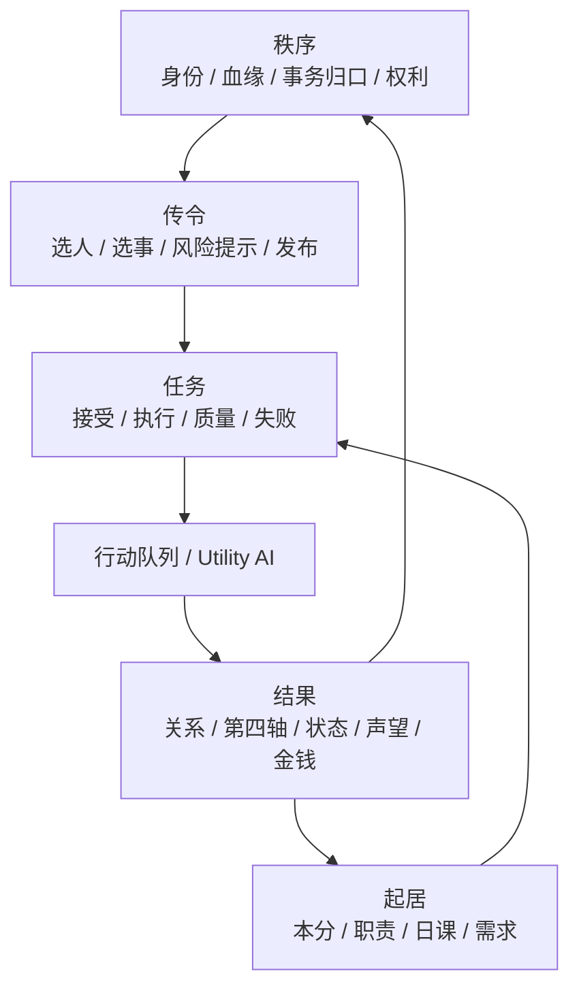

# 任务、起居、传令与秩序方向 PRD（讨论稿）

> 日期：2026-07-09
> 文档定位：整理当前项目差异化方向，不作为立即开工清单。后续讨论成熟后，再拆成系统 PRD 和实现任务。

## 1. 核心判断

《大观园模拟》如果只往“画面表现”和“家具交互丰富度”走，很难和《模拟人生》、inZOI 拉开差距。

这些游戏的强项是：

- 画面工业能力强。
- 家具、动作、装扮、建造和生活交互非常丰富。
- 现代生活题材易于理解，内容量可以靠资产和动作堆叠。

本项目短期不适合正面竞争画面与资产规模。真正有机会做出特色的方向，是向“任务”“起居”“传令”“身份秩序”“人情关系”和“执行后果”倾斜。

一句话方向：

```text
玩家不是在摆弄小人生活，而是在一个等级森严、关系密集的古代共同体里，通过传令、起居和人情操作人物命运。
```

## 2. 差异化切入点

### 2.1 现代生活模拟的弱点

现代生活模拟通常更擅长自由建造、角色外观、家具互动和日常动作，但在人与人之间的“操控感”和“制度压力”上相对弱。

典型问题：

- 人与人关系多是平等个体之间的好感、恋爱、家庭或职业关系。
- 玩家很少能通过制度、身份、上下级、传话、差遣等方式间接影响他人。
- 人物行为往往缺少身份、职责、命令和秩序结算带来的长期压力。

### 2.2 本项目的机会

红楼 / 古代大宅 / 皇宫题材天然有一套可玩结构：

- 上下级。
- 主仆。
- 长幼。
- 内外。
- 名分。
- 礼法。
- 职责。
- 差遣。
- 值守。
- 越权。
- 人情。
- 积怨。

这些结构可以被做成系统，而不只是背景设定。

## 3. 设计重心

后续设计重心建议收束为四句话：

- 传令是主操作。
- 起居是人物真实生活。
- 任务是传令和职责落地后的执行单元。
- 秩序是环境参数，也是人物做事后被结算出来的府内后果。

## 4. 三层核心系统

更新口径：这里实际应按“四层”理解，避免把传令、任务和秩序混在一起。故事线不进入本组核心架构；当前讨论只覆盖已实现或正在接入的系统。

```text
秩序：谁名义上该管什么，什么叫合礼法。
起居：人物在没有玩家干预时，本来应该怎样生活。
传令：玩家或 NPC 通过身份关系，把命令发出去。
任务：命令、职责和 AI 候选落地后的执行单元。
```

更准确的数据流：



模块边界：

| 模块 | 玩家看见的入口 | 回答的问题 | 产出 |
|---|---|---|---|
| 秩序 | 顶部【秩序】 | 谁该管？这道命令合不合身份？越权会怎样？ | 事务归口、管事评估、礼法解释、去传令跳转 |
| 起居 | 底部【起居】/AI 日常 | 这个人今天本来该做什么？ | 日课、随侍、职业职责、生活惯性 |
| 传令 | 底部【传令】/人物互动【传令】/当值【令】 | 当前人物能让谁做什么？对方愿不愿意？ | 任务发布请求、风险提示、预计接受 |
| 任务 | 【任务】面板 | 这件事谁接了、做没做、做得怎样？ | 任务实例、完成/失败、质量结算 |

注意：

- 秩序不直接发任务，只解释制度并可跳转到传令。
- 传令是唯一玩家主动下发任务的操作入口。
- 起居不是玩家逐条派任务，而是人物本分和 AI 的生活惯性。
- 任务不负责解释身份制度，只记录和结算执行。
- 未实现的故事节点不进入本架构图；后续若重启叙事节点，应作为“读取结果的上层内容”，不是底层强依赖。

### 4.1 起居：生活秩序

起居不是简单日程表，而是“这个人今天应该成为什么样的人”。

每个人的一天应由以下因素共同决定：

- 身份本分。
- 职业职责。
- 主仆关系。
- 场景权限。
- 私人欲望。
- 需求状态。
- 关系牵引。
- 玩家传令。

示例：

- 黛玉需要安顿、请安、读书、歇息。
- 袭人需要随侍、照看、传话、服侍宝玉。
- 平儿需要在凤姐命令、人情关系和自身处境之间周旋。
- 王夫人需要理事、查问、敲打、维持府内秩序。

起居的目标不是限制 NPC，而是让 NPC 的行为有生活惯性和身份解释。

### 4.2 传令：权力操作

传令是最容易拉开差距的玩法。

传令不只是“派任务”按钮，而是古代社会里的管理、压迫、照拂、试探、拉拢和越权。

它应该回答：

- 谁能命令谁？
- 命令是否合礼法？
- 是否职责内？
- 对方为什么接受、拖延或拒绝？
- 这道命令会不会伤关系、积怨、立威或做人情？
- 命令是否通过中间人传达？
- 传令结果是否改变关系、第四轴、声望、秩序或后续起居？

示例：

- 贾母让人带黛玉去见宝玉，是亲情安排，也是府内承认。
- 王夫人让袭人盯着宝玉，是管理，也是控制。
- 凤姐让平儿去查账，是任务，也是信任。
- 掌事嬷嬷安排宫女换班，是秩序，也是职场斗争。
- 太监总管传皇帝口谕，是权力链条的震动。

### 4.3 任务：执行与反馈

任务是传令、职责和 AI 意图落地后的执行单元。

任务不应只记录“完成 / 失败”，还应记录：

- 发布者。
- 执行者。
- 来源：传令、职业日课、AI 自发、系统调试。
- 是否职责内。
- 是否越权。
- 接受概率。
- 执行质量。
- 拖延、敷衍、拒绝、转派、求助等过程状态。
- 对关系、信任、服从/体恤/孝道、积怨、声望、技能和秩序的反馈。

任务系统的价值，是把玩家的管理动作变成可解释的社会后果。

### 4.4 秩序：环境与结算

秩序不是一个普通任务，也不是一个剧情节点。它有两层：

```text
秩序环境：当前府里已有的法度、人心、体面、腐败等环境参数。
秩序结算：人物做事以后，对这些参数造成的变化。
```

例子：

- 法度高时，越权传令更容易被记录和反噬。
- 人心低时，下人更容易拖延、敷衍、告状或抱团。
- 体面高时，主子的传令更容易被接受，但失败后损失也更明显。
- 腐败高时，事情可能更快办成，但长期会带来克扣、吃空饷和派系闭环。

## 5. 近期验证场景：林黛玉进贾府

当前不急于做大规模剧情。完善系统后，优先只做一个高密度系统验证 demo：

```text
林黛玉进贾府
```

目标：用一个场景把移动、社交、礼法、传令、起居、任务、关系、第四轴和秩序结算一一展开，验证项目方向是否成立。

这个 demo 应该让玩家感到：

```text
我不是点了几个互动按钮，
我是通过府里的规矩、人情和命令，
拨动了一场红楼事件。
```

### 5.1 可展开的系统

| 系统 | 在“林黛玉进贾府”中的作用 |
| --- | --- |
| 移动 | 黛玉入府，前往指定地点或靠近关键人物。 |
| 礼法 | 先见谁、怎么见、是否合规。 |
| 传令 | 贾母、王夫人、凤姐等安排迎接、通报、安置、随侍。 |
| 起居 | 黛玉安顿、梳洗、歇息、见人、读书。 |
| 任务 | 迎接、引路、取物、整理行李、通报、安排住处。 |
| 关系 | 贾母疼惜、宝玉好奇、王夫人审视、丫鬟服侍。 |
| 第四轴 | 主仆服从、长幼孝道/慈爱、客居情分影响执行意愿。 |
| 状态 | 紧张、思亲、疲惫、受宠、拘谨、安心等。 |
| 秩序 | 谁通传、谁安置、谁越权、谁得体，最终影响法度、人心、体面。 |

### 5.2 示例流程草案

不是最终设计，仅作为讨论起点：

1. 黛玉进府，贾母命人相迎。
2. 玩家选择让谁去接：袭人、紫鹃、平儿、周瑞家的等，不同人带来不同口径和关系影响。
3. 黛玉到贾母处请安，礼法顺则关系稳；拖延、走错、先见旁人会产生微妙评价。
4. 贾母传令安顿黛玉，玩家安排丫鬟、房间、梳洗、饮食。
5. 宝玉想见黛玉，玩家可以顺势安排、拖一拖、先让王夫人见，或让下人通报。
6. 初见后根据黛玉状态、宝玉状态、礼法顺序、在场人物和前置传令，结算不同关系、第四轴与秩序后果。

## 6. 未来扩展：皇宫场景

皇宫场景会进一步强化角色扮演、权力链条和职场斗争。

可能角色：

- 皇帝。
- 掌事嬷嬷。
- 太监总管。
- 御前侍卫。
- 宫女。
- 妃嫔。
- 内务府相关角色。

皇宫比贾府更强调：

- 命令层级。
- 值守轮班。
- 口谕传达。
- 宫规惩罚。
- 职位升降。
- 派系斗争。
- 近身侍奉风险。
- 权力距离。

贾府相对简单，适合作为第一阶段验证；皇宫适合作为后续扩展场景。

## 7. 贾府管理关系样例

贾府中可以先验证较温和的管理链条：

- 贾母。
- 贾政。
- 王夫人。
- 邢夫人。
- 周瑞家的。
- 林之孝家的。
- 袭人。
- 平儿。
- 宝玉。
- 黛玉。

这些人物足以验证：

- 长辈传令。
- 主仆传令。
- 管事传令。
- 贴身随侍。
- 跨院差遣。
- 越权风险。
- 人情周旋。
- 少爷小姐的间接影响力。

## 8. 当前不立即开工的原因

这份 PRD 只是方向收束，不立刻进入实现。

原因：

- 需要继续讨论玩法边界。
- 需要先把任务、起居、传令、身份礼法、职业、第四轴和秩序之间的系统关系想清楚。
- 需要避免为了 demo 写死一次性剧情。
- 需要决定哪些是底层能力，哪些只是“林黛玉进贾府”的内容配置。

## 9. 后续讨论问题

后续可以继续讨论：

- 玩家默认扮演谁？是“当前人物”、府内管理者，还是一种更抽象的导演/管家视角？
- 传令是否允许中间人转达？
- 任务失败是直接失败，还是有拖延、敷衍、误传、转派等过程？
- 起居是玩家主动安排，还是人物自己有本分，玩家通过传令干预？
- “林黛玉进贾府”第一版 demo 应该控制在多少分钟？
- 哪些礼法流程必须发生，哪些安排可被玩家改变？
- 贾府和皇宫是否共用同一套管理权限系统？
