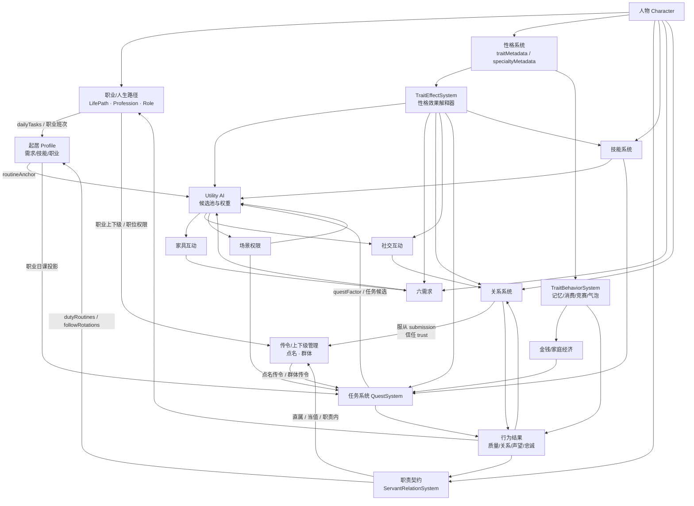
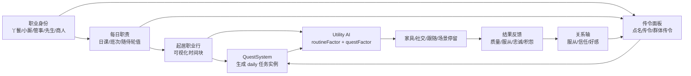
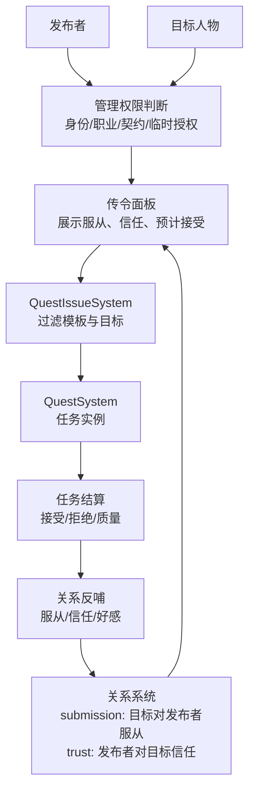
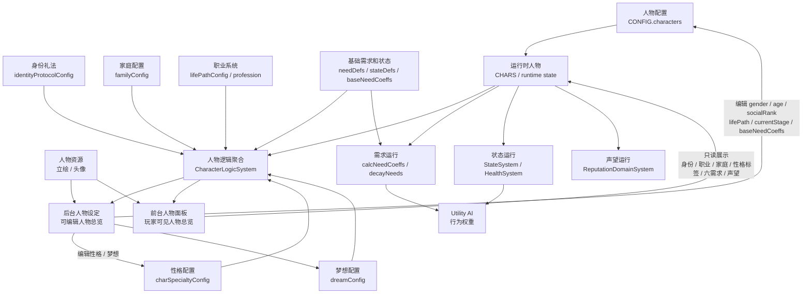
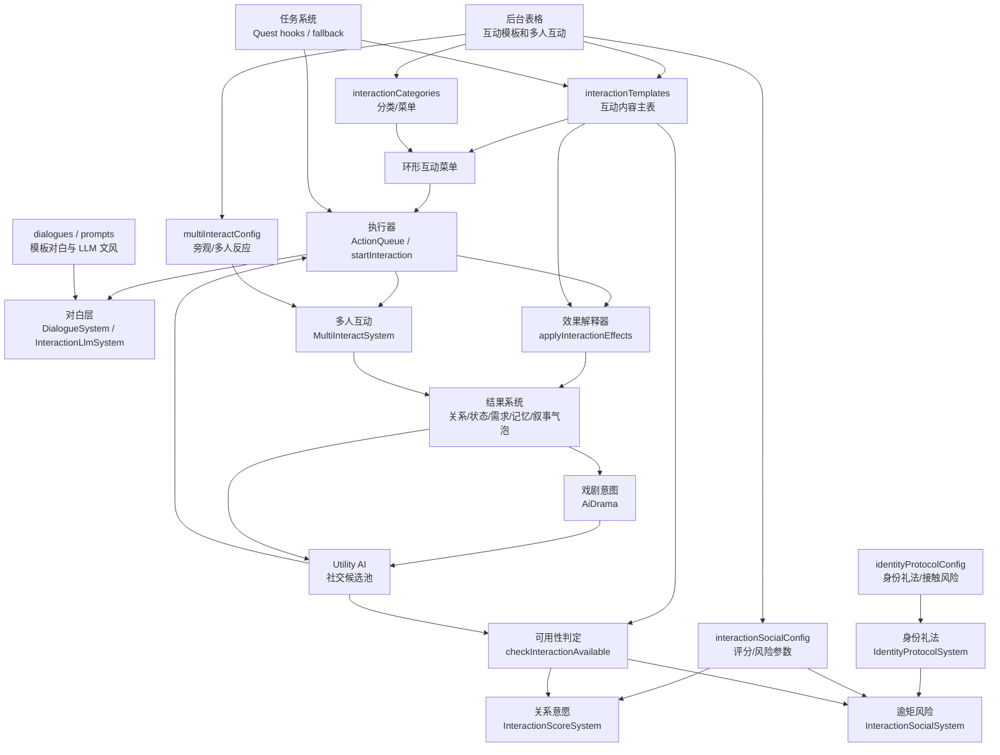
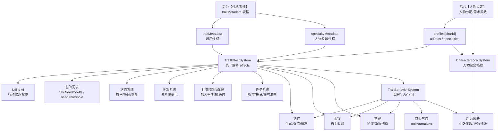

# 大观园整体系统架构依赖图

> 本文档单独维护系统之间的架构依赖图。业务 PRD 只保留局部规则，并引用本文，避免同一张图在多份文档里分叉。

## 1. 当前核心依赖图



## 2. 职业、起居、任务、传令局部链路



## 3. 传令与关系接入



## 4. 当前优先级口径

```text
严重需求危机 / 安全
  > 强制剧情 / 高优先临时任务
  > 随侍轮值 / 职业日课
  > 普通起居活动
  > 闲逛 / 普通社交 / 随机家具
```

## 5. 人物档案前后台架构图



### 人物档案口径

```text
后台人物设定 = 可配置版人物总览：以表格和输入框为主，写回 CONFIG。
前台人物面板 = 展示版人物总览：读取同一份人物逻辑，不暴露 JSON、需求系数和后台配置细节。
共同口径 = 身份、家庭身份、职业阶段、性格/梦想、六需求、状态、声望、资源。
运行闭环 = baseNeedCoeffs 进入 calcNeedCoeffs，再影响需求衰减、家具恢复和 Utility AI 权重。
```

## 6. 社交互动配置化架构图



### 社交配置化边界

```text
已配置化：
interactionTemplates / interactionCategories / interactionSocialConfig /
multiInteractConfig / identityProtocolConfig / dialogues / prompts

仍由代码解释：
互动执行流程 / 可用性判定顺序 / effect.type 解释器 /
AI 选互动逻辑 / reactionType 执行器 / 任务到互动 fallback /
非 LLM 对白回退 / 风险和礼法公式 / 站位与镜头体验
```

## 7. 性格系统配置化架构图



### 性格接口边界

```text
配置入口：
traitMetadata = 通用性格定义
specialtyMetadata = 人物专属性格定义
profiles.aiTraits = 人物拥有的通用性格
profiles.specialties = 人物拥有的专属性格

统一解释：
TraitEffectSystem.effectsOf(c)
  = traitMetadata.effects + specialtyMetadata.effects

运行接入：
AI / 需求 / 状态 / 关系 / 社交 / 任务 / 记忆 / 金钱 / 竞赛
均只读取 TraitEffectSystem 公开接口，不直接遍历配置表。

长期行为：
TraitBehaviorSystem 监听事件并处理记忆衰减、自主消费、竞赛结果、性格气泡和行为统计。
```

## 8. 架构维护规则

- 系统级依赖图统一放在本文。
- 业务 PRD 可描述自己的局部流程，但不要复制全局图。
- 新系统接入时先补本文，再回到对应业务 PRD 写字段和验收。
