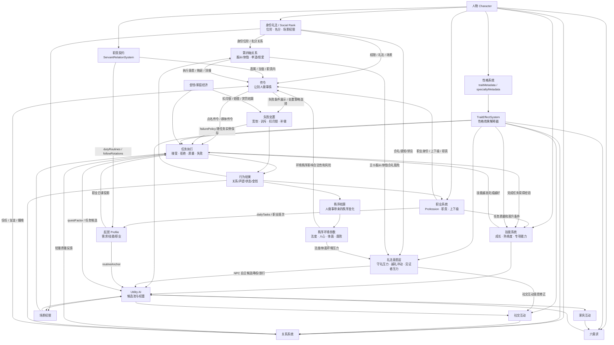
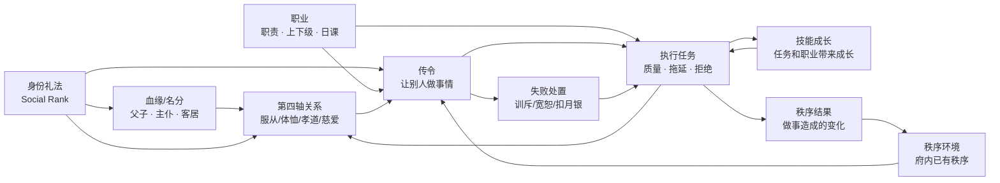
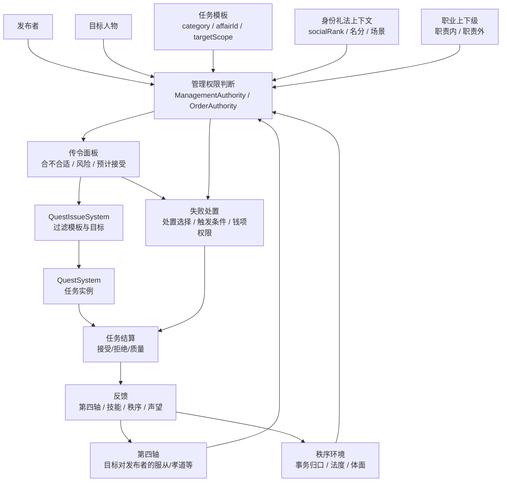
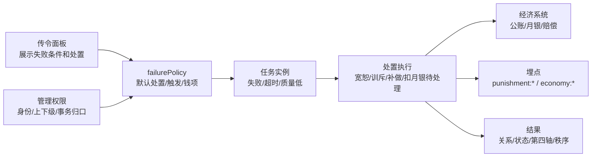
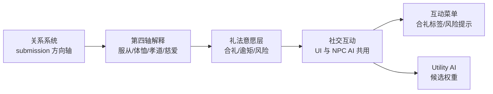
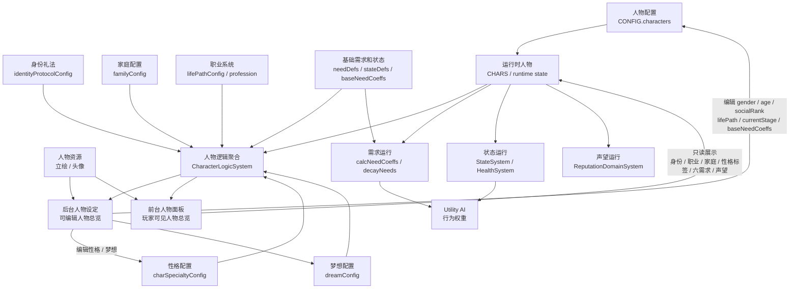
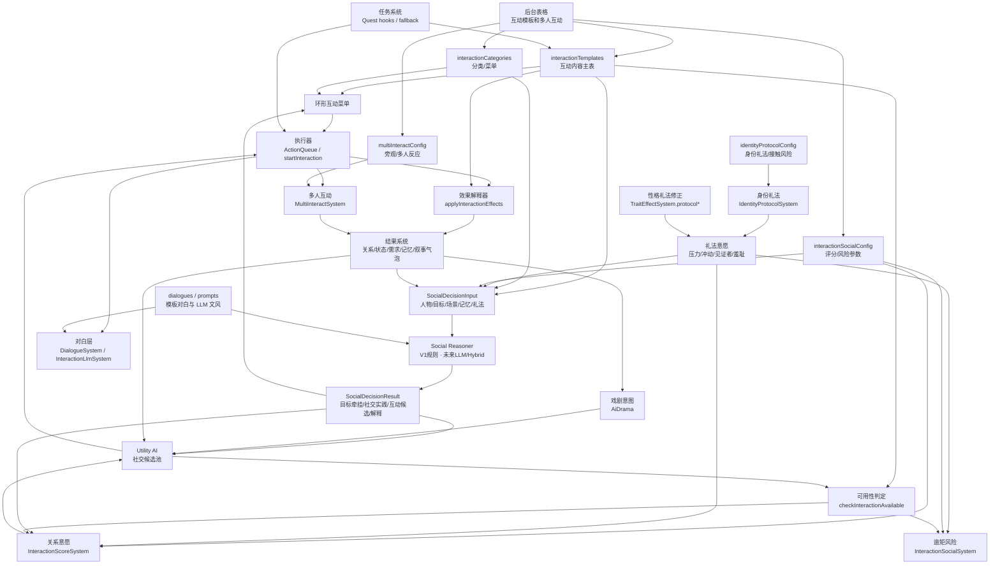
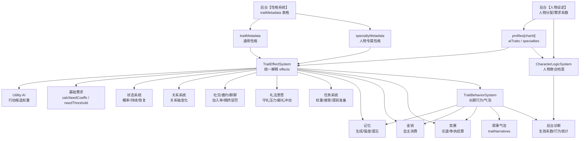

# 大观园整体系统架构依赖图

> 本文档单独维护系统之间的架构依赖图。业务 PRD 只保留局部规则，并引用本文，避免同一张图在多份文档里分叉。

## 1. 当前核心依赖图



## 2. 强耦合核心：身份、职业、传令、第四轴、秩序、技能



### 核心口径

```text
身份礼法 socialRank：决定人自身的位阶、场景权限、能不能压得住场。
职业：决定人承担什么职责、有哪些上下级、每天天然做什么。
第四轴关系：由身份、血缘、名分带来的方向性关系轴，不是普通好感。
传令：当前人物让别人做事情的操作层。
任务执行：传令、职业日课和 AI 候选落地后的执行层。
技能：职业和任务会带来成长；技能反过来提高任务质量。
秩序：类似环境参数。府内先有秩序环境；人做事后再结算秩序变化。
礼法意愿：身份礼法判断“合不合礼”，性格判断“愿不愿守、敢不敢破”，二者共同进入社交互动意愿和 NPC 自主候选权重。
```

2026-07-14 补充：

- 第四轴已直接接入礼法意愿层：主仆日常照拂类互动读取“服从/体恤”，达标时可判为合礼，不再按普通主仆接触直接逾矩。
- 任务失败的自动关系反馈已调轻；重罚由传令失败处置承接，避免普通日课失败持续吞噬主仆关系。

相关 PRD 已整理为相邻编号：

| 编号 | 文档 | 本图中的位置 |
|---|---|---|
| 23 | `持续更新_23身份礼法与场景权限.md` | 身份礼法 / Social Rank |
| 24 | `持续更新_24职业系统.md` | 职业 / 职责 / 上下级 |
| 25 | `持续更新_25传令与上下级管理面板.md` | 传令 / 让别人做事情 |
| 26 | `持续更新_26_秩序管理与第四轴玩法.md` | 秩序环境 / 第四轴 / 秩序结算 |
| 27 | `持续更新_27_人物技能与成长.md` | 技能成长 / 任务质量 |

## 3. 传令与秩序接入



注意：故事线不进入当前核心依赖图。现阶段可把 `lifePathConfig.storyNodes` 视作配置遗留或调试入口，不作为身份/职业/传令/秩序/技能闭环的必需依赖。

## 3.1 失败处置接入



口径：

- 失败条件属于任务系统，回答“怎样算失败”。
- 失败处置属于传令/管理系统，回答“失败后如何处理”。
- 钱项处罚必须先经过身份、上下级和事务归口判断，再交给经济系统。
- 当前实现先支持提示、策略记录、基础处置和埋点；个人月银账户上线前，扣月银以待处理/需背书形式记录。
- 当前任务质量失败只做轻量自动反馈；训斥、扣月银、禁足等重处罚由 `failurePolicy` 或玩家复核触发。

## 3.2 第四轴与礼法意愿接入



口径：

- 主仆场景下，仆从对主子读取 `submission` 作为服从。
- 主子对仆从的体恤由反向 `submission` 派生，用于礼法解释，不进入综合关系分。
- 服从/体恤只影响“是否合礼、意愿强弱、风险提示”，不负责解锁/隐藏互动。
- 综合关系标签暂时只展示，不进入 AI 决策。

## 4. 当前优先级口径

```text
严重需求危机 / 安全
  > 高优先临时任务 / 玩家传令
  > 随侍轮值 / 职业日课
  > 普通起居活动
  > 闲逛 / 普通社交 / 随机家具
```

## 5. 人物档案前后台架构图



### 人物档案口径

```text
后台人物设定 = 可配置版人物总览：以表格和输入框为主，写回 CONFIG。
前台人物面板 = 展示版人物总览：读取同一份人物逻辑，不暴露 JSON、需求系数和后台配置细节。
共同口径 = 身份、家庭身份、职业阶段、性格/梦想、六需求、状态、声望、资源。
运行闭环 = baseNeedCoeffs 进入 calcNeedCoeffs，再影响需求衰减、家具恢复和 Utility AI 权重。
```

## 6. 社交互动配置化架构图



### 社交配置化边界

```text
已配置化：
interactionTemplates / interactionCategories / interactionSocialConfig /
multiInteractConfig / identityProtocolConfig / dialogues / prompts

新增稳定协议：
SocialDecisionInput / SocialDecisionResult。
当前 Social Reasoner 由规则、阈值和权重实现；未来可替换为 LLM 或 hybrid，
但输入、输出、解释字段、硬条件校验和 ActionQueue 执行协议不变。

仍由代码解释：
互动执行流程 / 可用性判定顺序 / effect.type 解释器 /
AI 选互动逻辑 / reactionType 执行器 / 任务到互动 fallback /
非 LLM 对白回退 / 风险和礼法公式的参数化后台 / 站位与镜头体验
```

## 7. 性格系统配置化架构图



### 性格接口边界

```text
配置入口：
traitMetadata = 通用性格定义
specialtyMetadata = 人物专属性格定义
profiles.aiTraits = 人物拥有的通用性格
profiles.specialties = 人物拥有的专属性格

统一解释：
TraitEffectSystem.effectsOf(c)
  = traitMetadata.effects + specialtyMetadata.effects

运行接入：
AI / 需求 / 状态 / 关系 / 社交 / 礼法意愿 / 任务 / 记忆 / 金钱 / 竞赛
均只读取 TraitEffectSystem 公开接口，不直接遍历配置表。

长期行为：
TraitBehaviorSystem 监听事件并处理记忆衰减、自主消费、竞赛结果、性格气泡和行为统计。
```

## 8. 架构维护规则

- 系统级依赖图统一放在本文。
- 业务 PRD 可描述自己的局部流程，但不要复制全局图。
- 新系统接入时先补本文，再回到对应业务 PRD 写字段和验收。
