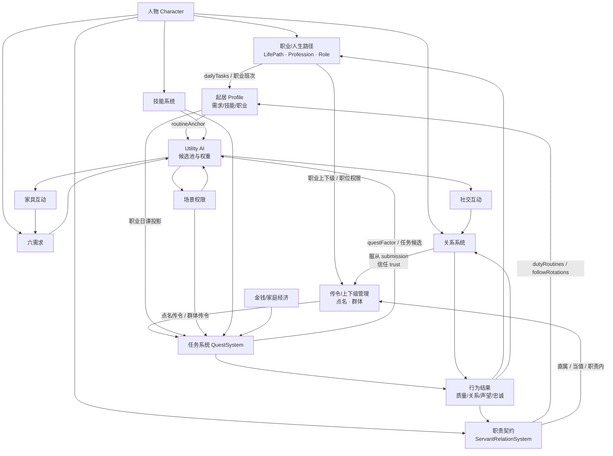
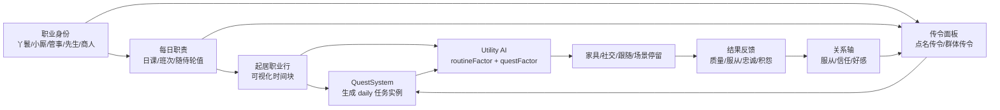
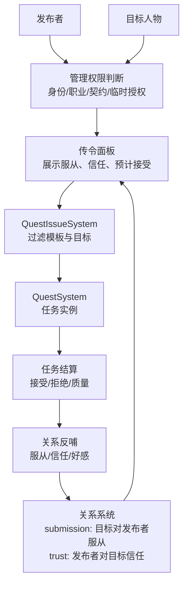

# 大观园整体系统架构依赖图

> 本文档单独维护系统之间的架构依赖图。业务 PRD 只保留局部规则，并引用本文，避免同一张图在多份文档里分叉。

## 1. 当前核心依赖图



## 2. 职业、起居、任务、传令局部链路



## 3. 传令与关系接入



## 4. 当前优先级口径

```text
严重需求危机 / 安全
  > 强制剧情 / 高优先临时任务
  > 随侍轮值 / 职业日课
  > 普通起居活动
  > 闲逛 / 普通社交 / 随机家具
```

## 5. 架构维护规则

- 系统级依赖图统一放在本文。
- 业务 PRD 可描述自己的局部流程，但不要复制全局图。
- 新系统接入时先补本文，再回到对应业务 PRD 写字段和验收。
